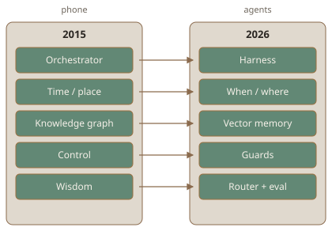

# Peramanathan Sathyamoorthy

**Builder of useful things** · **LEA**r**NING** in re**PUBLIC**

**2015 orchestration boxes → 2026 agent stacks** · one person, live proof

Stockholm · C · Python · TypeScript · Rust · <abbr title="Energy Efficiency as an Orchestration Service">EEaaS</abbr> lineage

&nbsp;

&nbsp;

&nbsp;

&nbsp;

&nbsp;

&nbsp;

&nbsp;

 
<kbd><a href="#an-inch-at-a-time">story</a></kbd>
<kbd><a href="#that-machine-running">now</a></kbd>
<kbd><a href="#featured">featured</a></kbd>
<kbd><a href="#cooking">cooking</a></kbd>
<kbd><a href="#proof-of-concepts">pocs</a></kbd>
<kbd><a href="#long-arc">long arc</a></kbd>
<kbd><a href="#more">more</a></kbd>

---

> [!IMPORTANT]
> **One person.** This stack does not recur.

- **<abbr title="Elm Model–View–Update">MVU</abbr> in C** — [elomaxz](https://github.com/p10ns11y/elomaxz)
- **Desktop agent reactor** — [kanithanj.ai](https://github.com/p10ns11y/collab-finder/releases)
- **Arch Linux + Tamil <abbr title="landscape-season poetic ecology">tinai</abbr> + circadian** — [arch-machine](https://github.com/p10ns11y/arch-machine)
- **Tamil poetic metre → <abbr title="WebAssembly">WASM</abbr>** — [thepulimaangani](https://github.com/p10ns11y/thepulimaangani)

[IEEE CloudCom 2015](https://ieeexplore.ieee.org/document/7396150) · [Wiley 2017](https://onlinelibrary.wiley.com/doi/10.1155/2017/6562915). **Same five boxes, new clothes** — not big-lab internals · [/focus](https://peramanathan-sathyamoorthy-cv.vercel.app/focus)

Six rows — phone → agent (text map)

<table>
<thead>
<tr>
<th align="left" valign="top" width="19%">2015 box</th>
<th align="left" valign="top" width="31%">On the phone</th>
<th align="left" valign="top" width="50%">2026 clothes</th>
</tr>
</thead>
<tbody>
<tr>
<td valign="top"><strong>Orchestrator</strong></td>
<td valign="top">Profile → predict → act under cost</td>
<td valign="top">Agent <strong>harness</strong>, graph runtime, permission tethers</td>
</tr>
<tr>
<td valign="top"><strong>Temporal–spatial</strong></td>
<td valign="top">Time + place change policy</td>
<td valign="top">Region, on-device vs cloud — <strong>time and place decide spend</strong></td>
</tr>
<tr>
<td valign="top"><strong>Knowledge graph</strong></td>
<td valign="top">Organize logs for cheaper next decision</td>
<td valign="top"><strong>Vector memory</strong> — embeddings / retrieval, not a property graph</td>
</tr>
<tr>
<td valign="top"><strong>Control box</strong></td>
<td valign="top">Actuator: radio, cap sensors</td>
<td valign="top"><strong>Guards</strong>: allowlists, rate limits, pause-on-cost</td>
</tr>
<tr>
<td valign="top"><strong>Wisdom box</strong></td>
<td valign="top"><abbr title="Key Energy Indicators">KEI</abbr> — <em>when</em> a signal earns an act</td>
<td valign="top"><strong>Router + eval</strong>: model choice, escalation, memory</td>
</tr>
<tr>
<td valign="top"><strong><abbr title="Key Energy Indicators">KEI</abbr></strong></td>
<td valign="top">Few cheap signals; no raw telemetry stream</td>
<td valign="top"><strong><abbr title="Key Decision Indicators">KDI</abbr></strong>: outcomes, corrections, confidence</td>
</tr>
</tbody>
</table>

> [!NOTE]
> I do **not** claim I designed GPT or Grok — these five boxes keep reappearing. Grok Build tweaks: **slight** token/$ wins; full eval **paused** on quota. Target: **quality per token per watt**. [intelli-arch-designs](https://github.com/p10ns11y/grok-build/tree/local/intelli-arch-designs) · [@thecuriousts](https://github.com/thecuriousts)

## That machine, running

Three clicks — eight more in [Featured](#featured).

- **[kanithanj.ai](https://github.com/p10ns11y/collab-finder/releases)** — installable agent reactor; guards before you step in · <kbd><a href="https://github.com/p10ns11y/collab-finder/releases">releases</a></kbd>
- **[devprofile](https://peramanathan-sathyamoorthy-cv.vercel.app/)** — live CV · <kbd><a href="https://peramanathan-sathyamoorthy-cv.vercel.app/qa">/qa</a></kbd> · <kbd><a href="https://peramanathan-sathyamoorthy-cv.vercel.app/focus">/focus</a></kbd> · xAI Collections, not a homemade vector stack
- **[thepulimaangani](https://github.com/p10ns11y/thepulimaangani)** — Tamil prosody in Rust → WASM; ML frozen before classical rules · [live](https://seiyul-alagi.vercel.app/)

## Connect

> [!TIP]
> <kbd><a href="https://peramanathan-sathyamoorthy-cv.vercel.app/">CV</a></kbd>
> ·
> <kbd><a href="mailto:sathyam.peram@gmail.com">email</a></kbd>
> ·
> <kbd><a href="https://x.com/peramanathan">X</a></kbd>
> ·
> <kbd><a href="https://x.com/Peramanathan/articles">Articles</a></kbd>

## An inch at a time

**A signal earns a move** — git dates, not memory:

- **2014–15** — [Sorkalam](https://github.com/p10ns11y/sorkalam-extension) in the toolbar while writing [EEaaS](https://ieeexplore.ieee.org/document/7396150)
- **Sep 2024** — [ama-about-me](https://github.com/p10ns11y/ama-about-me) — **before** Oneflow ended
- **Oct–Nov 2024** — [latex-cv](https://github.com/p10ns11y/latex-cv) → [adaptate](https://github.com/p10ns11y/adaptate) on npm
- **Dec 2024** — Oneflow closed. The chain did **not** start there.
- **2025** — [selfie sign-in](https://github.com/p10ns11y/selfie-sign-in-flow-using-v0-xAI) · [Ask Grok](https://github.com/p10ns11y/grok-daily-productivity-extensions) · [devprofile](https://github.com/p10ns11y/devprofile) (Sep)
- **Jan–Mar 2026** — [v0-live-feed](https://github.com/p10ns11y/v0-live-feed-app) · [agenc-protocol](https://github.com/p10ns11y/agenc-protocol) (**fork** — not my protocol)

Then months of **parent duty**, then the 2026 instances below.

## Featured

Three open — rest folded. Same three as [running now](#that-machine-running).

### [thepulimaangani](https://github.com/p10ns11y/thepulimaangani) · TS · Rust · <abbr title="WebAssembly">WASM</abbr> · [Live](https://seiyul-alagi.vercel.app/)

ML beliefs frozen *before* classical metre rules ([issue #36](https://github.com/p10ns11y/thepulimaangani/issues/36)). Each parse → **51-number vector** (counts and linkage histograms — **no raw text**). Offline: random sampling, dimension reduction, logistic fit, sequence-label sketches, control-style plant / observer / controller. Online: WASM **predicts metre on every parse**; the classical checker stays empty until that evidence is frozen.

### [kanithanj.ai](https://github.com/p10ns11y/collab-finder/releases) · TS · Rust

Installable Linux agent + **Heading** screen (next act, not a hunt board). **Guards** on fit, cost, rate, CV promote. Rust keyring; apply CV never overwrites master résumé. <kbd><a href="https://github.com/p10ns11y/collab-finder/releases">Releases</a></kbd>.

### [elomaxz](https://github.com/p10ns11y/elomaxz) · C · [on X](https://x.com/Peramanathan/status/2060627340972151099)

**Elm <abbr title="Model–View–Update">MVU</abbr> in C11:** a tagged message in; a pure `update` returns new state plus commands; the shell runs effects. Composition is actor-style. The program I open every day is **[premflow](https://github.com/thecuriousts/premflow)** — not a `counter` demo.

Eight more of that machine

### [sorkalam-extension](https://github.com/p10ns11y/sorkalam-extension) · JS · 2014→2026

**Built in a hurry. Used for the thesis.** Highlight → meaning **in the popup** → pick a **better word** without leaving [Energy Efficiency as an Orchestration Service](https://ieeexplore.ieee.org/document/7396150). Wiktionary and Tamil Virtual University stay **in the popup**. Grok and Grokipedia when you want **the subject and more context**, not just a gloss — they open in a new tab so the extension **does not pay model API bills**. Current Chrome extension format (Manifest V3). Tap for meaning; go deeper only when you ask.

### [arch-machine](https://github.com/p10ns11y/arch-machine) · Shell · Python · Rust

**`archy`** is a thin top controller plus domain jobs (Eagle + satellites) — not a pile of dotfiles. Thin host, then optional **machine-learning** or **security** profiles, evidence bundles, inventory, weekly scans. **groxy** talks to a Grok agent over the <abbr title="Agent Client Protocol">ACP</abbr>, or pings you on X. eye-comfort: body-clock lighting + latitude + Tamil <abbr title="landscape-season">tinai</abbr> and the <ruby>நாழிகை<rt>nāḻikai · 24-minute clock</rt></ruby>. After Omarchy resets the status bar, personal-tweaks put the Heading chip back.

### [shellyxz.sh](https://github.com/p10ns11y/shellyxz.sh) · Shell

**Kernel versus plugin** on zsh, bash, and fish: a PATH contract, plus `ab` / `av` / `at` panes to **review agent work**. An ontology skill so agents stop moving files across the kernel boundary.

### [adaptate](https://github.com/p10ns11y/adaptate) · TS · [npm](https://www.npmjs.com/package/adaptate)

One optional Zod schema. **Each API consumer names which fields it requires at run time.** OpenAPI `$ref` in, Zod out. Multi-tenant APIs where a static `required:` list dies.

### [skills](https://github.com/p10ns11y/skills) · [skills.sh](https://skills.sh/p10ns11y/skills)

**Scars, not best-practices.** Formal-first `SKILL.md`. **EVA emptiness** = a prior when the map is missing (do not pretend you already know). Fission then fusion of context. **Cognitive-load dual track:** a human’s working memory versus an agent’s parallel tools. Extracted after the fighting stopped — not designed in a vacuum.

### [agent-prompt-tuning-lab](https://github.com/p10ns11y/agent-prompt-tuning-lab) · JS

Harvest **Cursor + Grok Build + Kilo + Cline** on disk. Raw transcripts, harness dumps, and agent **dotfiles stay local**. Only the **distill** step talks to a language model — and only **tidied, extracted turns**, not the bulk session. Then **Rhai** workflow scripts. No bundled dataset.

### [prototype-it-to-explain-itself](https://github.com/p10ns11y/prototype-it-to-explain-itself) · Python · [Live](https://prototype-it-to-explain-itself.sathyam-peram.workers.dev/)

A tiny character LSTM (next-token net), a **<abbr title="Reason + Act + Observe">ReAct</abbr>** loop (reason, then act, then observe), memory, a **self-critique data factory**, and a typed workflow — the agent-improves-itself flywheel you can hold in your head. [prototype-it-to-explain-itself](https://github.com/p10ns11y/prototype-it-to-explain-itself)

### [devprofile](https://github.com/p10ns11y/devprofile) · TS · [Live](https://peramanathan-sathyamoorthy-cv.vercel.app/) · [/qa](https://peramanathan-sathyamoorthy-cv.vercel.app/qa)

**Retrieve-then-answer was already in xAI Collections.** Upload persona and CV — **xAI** splits the text and builds the vectors (I noticed them appear on upload; it was not a loud feature while X was still yelling “build your own retrieve-then-answer stack”). <kbd>/qa</kbd> only **searches** (`documents/search`) and asks Grok. No chunker, no embed model, no Pinecone or Postgres-vector store of my own. Local `qa-index.json` is the fallback when that reactor is off. [**/focus**](https://peramanathan-sathyamoorthy-cv.vercel.app/focus).

## Cooking

- **[ensembly](https://github.com/thecuriousts/ensembly)** — **Game of Peram**: HOOTL kernel; you keep **authorization**. life-os is memory; this is the running clone.
- **[life-os](https://github.com/p10ns11y/life-os)** — notes vault; **process-safety** rule (no live hiring IDs on git). Runtime is ensembly.
- **[plugins](https://github.com/p10ns11y/plugins)** — Grok marketplace · **mission-map**: PERT-style C estimates + Rust heading diagram; nightly rewrite.
- **[premflow](https://github.com/thecuriousts/premflow)** — notes, wins, terminal pomodoro on elomaxz. I live in it.
- **[Ask Grok](https://github.com/p10ns11y/grok-daily-productivity-extensions)** — 2025 cousin of Sorkalam: page-context Grok; key stays local.

## Proof of concepts

- **[v0-live-feed](https://v0-live-feed-app.vercel.app/)** — X “For You” as flow, not chrome clone · [repo](https://github.com/p10ns11y/v0-live-feed-app)
- **[selfie sign-in](https://v0-selfie-sign-in-process.vercel.app)** — enroll → train → login · [repo](https://github.com/p10ns11y/selfie-sign-in-flow-using-v0-xAI)

## Long arc

The diagram above is the claim. This is **evidence** and **honest limits**.

When the calendar slips, **ship more than was asked** — not a thin late apology. Diagrams: [**/focus**](https://peramanathan-sathyamoorthy-cv.vercel.app/focus). Small token/$ wins after Grok Build tweaks; quality/perf eval **paused** on quota. Fleet learning is the provider’s job. [intelli-arch-designs](https://github.com/p10ns11y/grok-build/tree/local/intelli-arch-designs).

Thesis & papers · 2015–2017

- **Thesis PDF** — [hosted full text](https://peramanathan-sathyamoorthy-cv.vercel.app/pdfs/master-thesis.pdf) · [devprofile#32](https://github.com/p10ns11y/devprofile/pull/32)
- **Uppsala DiVA** — [record](http://uu.diva-portal.org/smash/record.jsf?pid=diva2:893525) · [FULLTEXT01](https://www.diva-portal.org/smash/get/diva2:897798/FULLTEXT01.pdf) (often blocked off-campus)
- **IEEE CloudCom 2015** — [EEaaS paper](https://ieeexplore.ieee.org/document/7396150)
- **Wiley 2017** — [profiling paper](https://onlinelibrary.wiley.com/doi/10.1155/2017/6562915)
- **On X** — [long arc post](https://x.com/Peramanathan/status/2035707867844809074) · [/focus write-up](https://peramanathan-sathyamoorthy-cv.vercel.app/focus)

Prefer hosted PDF when DiVA fails.

Course craft · 2011

- **Report PDF** — [ML face-recognition (2011)](https://peramanathan-sathyamoorthy-cv.vercel.app/pdfs/ml_face_recognition_report_2011.pdf)
- **On X** — [delayed work, shipped more](https://x.com/Peramanathan/status/2064993180328796667)

Uppsala ML course — assignment ran late; extended into real implementation (finished solo). Same muscle as today.

## Writing & packages

I write when the stake is real — [long-form on X](https://x.com/Peramanathan/articles), not take-farming. [Rust from First Principles](https://github.com/thecuriousts/shelf-life/blob/writealive/coding/rust_from_first_principles_companion.pdf) is a companion, not a tutorial dump.

npm since **2017**: [`adaptate`](https://www.npmjs.com/package/adaptate) (2024) · [`@p10ns11y/hy`](https://www.npmjs.com/package/@p10ns11y/hy) (2021) · [`react-redux-quest`](https://www.npmjs.com/package/react-redux-quest) (2018) · [`babel-plugin-react-intl-messages-generator`](https://www.npmjs.com/package/babel-plugin-react-intl-messages-generator) (2017). [~p10ns11y](https://www.npmjs.com/~p10ns11y)

## More

Open source — landed in other people’s trees

- **Zod** nullish chaining — [PR #1702](https://github.com/colinhacks/zod/pull/1702) (2022)
- **react-intl** — [babel-plugin-react-intl-messages-generator](https://www.npmjs.com/package/babel-plugin-react-intl-messages-generator) (2017)
- **Kent C. Dodds** — [bookshelf #116](https://github.com/kentcdodds/bookshelf/pull/116) · [#184](https://github.com/kentcdodds/bookshelf/pull/184) · [testing-react-apps #39](https://github.com/kentcdodds/testing-react-apps/pull/39) · [#42](https://github.com/kentcdodds/testing-react-apps/pull/42)
- **React Boilerplate** — [PR #1355](https://github.com/react-boilerplate/react-boilerplate/pull/1355) (merged **2016**) · [#1364](https://github.com/react-boilerplate/react-boilerplate/pull/1364) · [#1167](https://github.com/react-boilerplate/react-boilerplate/pull/1167)

Archive — I was already public before it was a brand

Uppsala years: room to wander. Pro years: low time budget, honest stubs — not a victory lap.

Surfaces · samples · stubs

- **[சிரவை பெரமு](https://peramuwin.blogspot.com/)** — Uppsala · ~2012–2021 · Tamil poetry & language craft · [அகலா விளக்கு](https://peramuwin.blogspot.com/2021/04/blog-post_4.html) · [அவனும் அவளும்](https://peramuwin.blogspot.com/2021/04/blog-post.html) · [அடடே அன்பு மழை](https://peramuwin.blogspot.com/2021/03/blog-post_5.html) · [பணியிடை பனிநடை](https://peramuwin.blogspot.com/2021/02/blog-post.html)
- **[Prem Sathya’s Tea Stall](https://peramanathan.blogspot.com/)** — Uppsala · 2011–2013 · English essays · [Fourier as warrior](https://peramanathan.blogspot.com/2012/11/a-warrior-to-fourier-series.html) · [Vedic binary mult](https://peramanathan.blogspot.com/2012/03/binary-multiplication-can-we-do-it.html) · [constraint programming](https://peramanathan.blogspot.com/2011/09/problem-from-real-world.html) · [ergonomics / RSI](https://peramanathan.blogspot.com/2011/05/ergonomics-and-repetitive-strain.html)
- **[On The Way](https://prem-ontheway.blogspot.com/)** — Uppsala · 2011 · Photo stops · [Autumn in Uppsala](https://prem-ontheway.blogspot.com/2011/06/autumn-in-uppsala.html) · [Sunnersta Lake](https://prem-ontheway.blogspot.com/2011/05/sunnersta-lake.html) · [Mannargudi Temple](https://prem-ontheway.blogspot.com/2011/05/mannargudi-temple.html)
- **[peramsathyam.fly.dev](https://peramsathyam.fly.dev/)** — Pro life · low bandwidth · personal site, craft + Tamil poems
- **[kingsparrow.space](https://kingsparrow.space/)** — Pro life · low bandwidth · sparse tech notes (domain may be reused later)

---

<blockquote>

<em>“He doesn’t need to predict the future. He’s been quietly preparing for it since 2016.”</em>

<a href="GROK_TESTIMONIAL.md">Grok · April 2026</a>

</blockquote>

If this still looks like everyone else — you skimmed.

